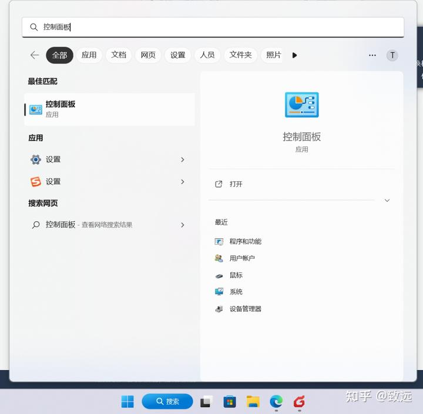
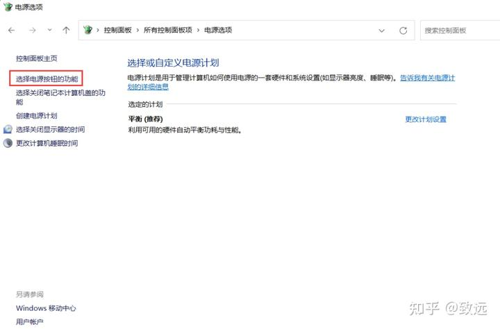
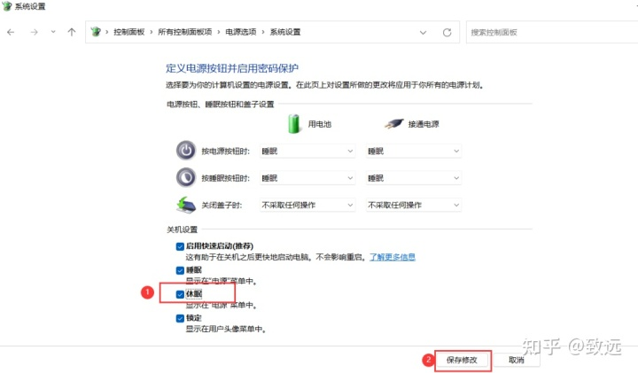
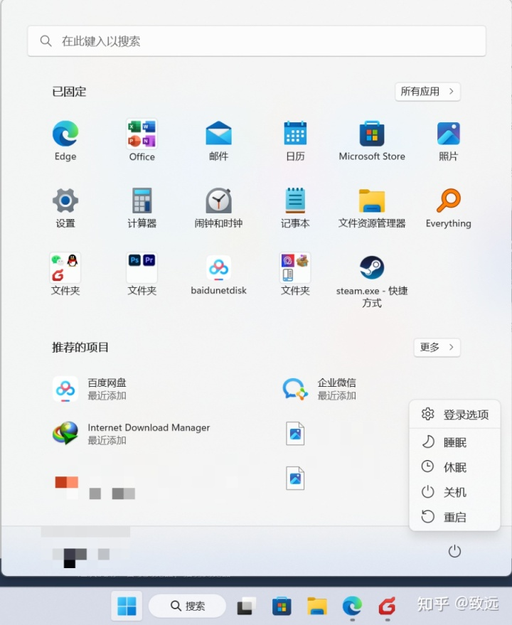

# 装机必备

## 01 Win11 安装跳过联网激活 / 使用本地账户登录
---

首次登陆 Win11 / 首次激活 windows11 时，无法使用本地账户登录，只能联网使用微软账户登录激活。

使用下面方法可以跳过联网，使用本地账户登陆

1、在 ` 让我们为你连接网络 ` 画面，

2、按住  `Shift+F10`, 或者笔记本可以安 `Fn+Shift+F10` 调出 CMD 命令窗口

3、输入命令 `oobe\bypassnro.cmd` 回车

接下来会自动重启，耐心等待

4、重启后，选择 ` 我没有 Internet 连接 ` 就可以使用本地账户登陆系统
了

## 02 Win 10/11 微软拼音一键导入小鹤双拼方案

---

> 背景

微软拼音目前已经相对完善，除了词库方面外，与目前国产输入法使用体验差异不大，可以作为日常输入法使用了。
但微软拼音目前仅内置三套双拼方案：微软双拼、智能 ABC、自然码；其他双拼方案需要手动添加，这里带来两种快捷添加方法，免去一个键位一个键位调整。

> 方法一：

通过导入注册表的方式来快捷添加。以下注册表为笔者手动设置后导出的注册表值。

注册表内容为：

```reg
Windows Registry Editor Version 5.00

[HKEY_CURRENT_USER\Software\Microsoft\InputMethod\Settings\CHS]
"Enable Cloud Candidate"=dword:00000000
"Enable Dynamic Candidate Ranking"=dword:00000001
"EnableExtraDomainType"=dword:00000001
"Enable self-learning"=dword:00000001
"EnableSmartSelfLearning"=dword:00000001
"EnableLiveSticker"=dword:00000000
"Enable EUDP"=dword:00000001
"Enable Double Pinyin"=dword:00000001
"UserDefinedDoublePinyinScheme0"="小鹤双拼 * 2*^*iuvdjhcwfg^xmlnpbksqszxkrltvyovt"
"DoublePinyinScheme"=dword:0000000a
```

新建 TXT 文本，复制粘贴以上内容后保存，将文件后缀更改为 `reg` 后双击导入注册表即可。

> 方法二：

手动添加注册表项目。

1. `Windows + R` 调出命令运行框，输入：`regedit` 后确认打开注册表；
2. 打开以下路径：`HKEY_CURRENT_USER\Software\Microsoft\InputMethod\Settings\CHS`
3. 新建字符串值，字符串名称为：`UserDefinedDoublePinyinScheme0`，值为：` 小鹤双拼 * 2*^*iuvdjhcwfg^xmlnpbksqszxkrltvyovt`
4. 退出后进入微软拼音设置，即可看到小鹤双拼方案已存在，选择保存即可。

## 03 内存自动清理

---

Mem Reduct：轻量级实时内存管理应用程序，用于监视和清理计算机上的系统内存。

- [https://www.henrypp.org/product/memreduct](https://www.henrypp.org/product/memreduct)

## 04 TrafficMonitor

--

显示当前网速、CPU 及内存利用率

- [https://github.com/zhongyang219/TrafficMonitor/releases](https://github.com/zhongyang219/TrafficMonitor/releases)

建议下载 Lite 文件，关闭悬浮窗，启用任务栏窗口。


## 05 在 Win11 中添加 “休眠” 选项

---

1、键盘按下 Windows+S 搜索 **控制面板** 并打开。

​​

2、点击右上方的查看方式，切换成 **大图标** 后点击下方的 **电源选项**

​​

3、在打开的 “电源选项 "，点击 **选择电源按钮的功能**。

​​

4、点击 **更改当前不可用的设置** 之后，下面的 “关机设置” 区域就由灰色不可用变成可以选择设置的状态了。如图：

​​

5、勾选 **休眠** 选项，最后点击 **保存修改** 按钮即可。

​​

再点击 Win11 开始菜单中的 “电源” 按钮，就可以看到 “休眠” 选项了。

​​
