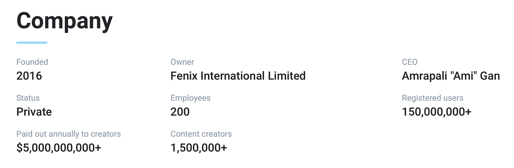
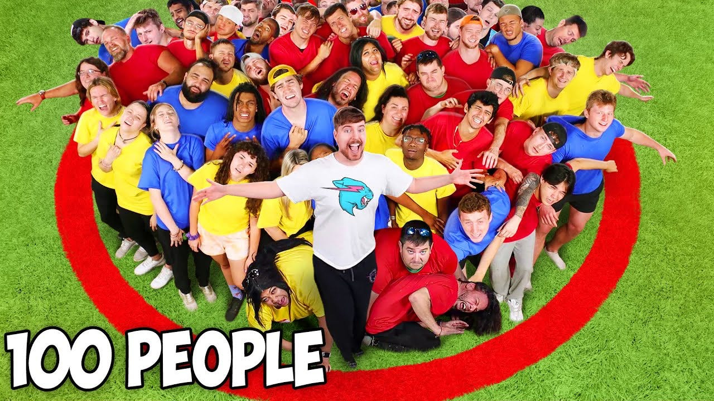
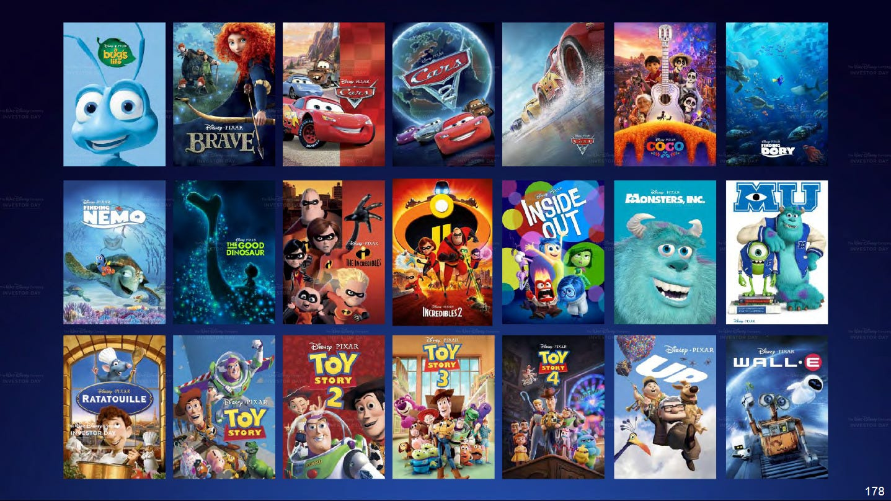
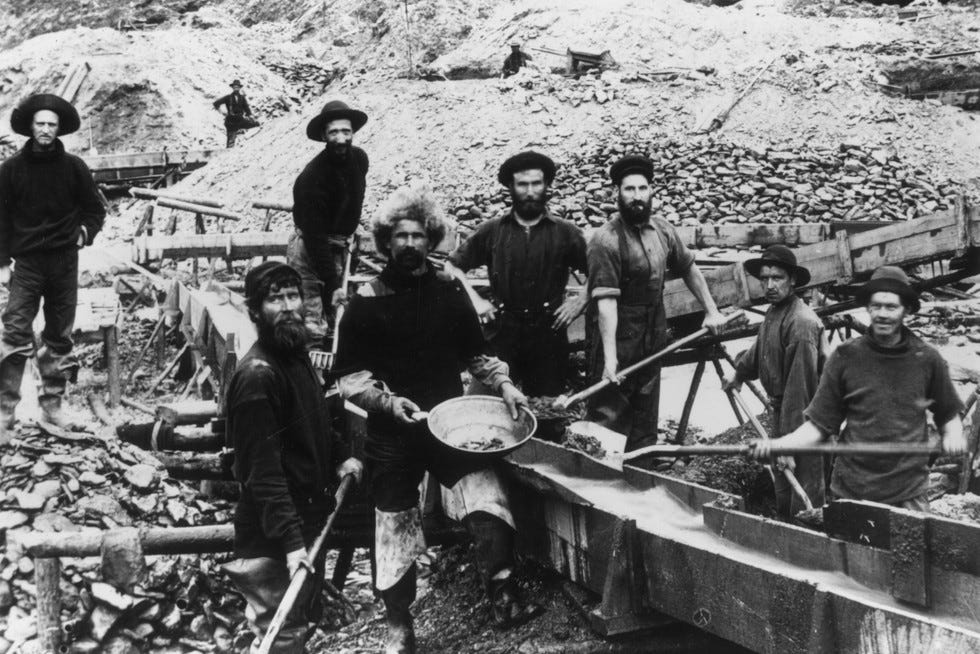

# 内容生产者所利用的人性

- [https://hardcored.substack.com/p/w9](https://hardcored.substack.com/p/w9)

### 哪些内容是受欢迎的？为什么？有没有通用的流量密码？

亲爱的读者朋友们，你是否经常在互联网上浏览各种内容，那么你是否有过这样的疑惑：

- 我宝贵的时间都被哪些内容给占据了？
- 是什么在驱使我去看这些内容的？

作为一个严重依赖互联网获取信息的人来说，我当然也有这样的疑惑。同时，我还会在业余时间里写点东西，姑且算是个小小的内容生产者，我当然也思考过这样的问题：

- 什么内容是人们爱看的？它们都有什么共同点？
- 人们希望从内容中获得什么？驱使人们去看某些内容的源动力是什么？
- 有没有通用的流量密码？

其实上面的这些问题，说的都是同一件事情：**人们爱看什么？**

这些问题都在驱使着我去思考问题的本质，这个本质就是 **人和人性**，毕竟，内容的消费者就是人。

想清楚了这些问题，作为内容消费者的你，能在人人都是内容生产者的时代里更加理性客观、从容不迫；作为内容生产者的你，也能生产更好的内容，来达到你的目的。

这有点像是左右互搏的过程，关键在于你是否知己知彼。

为了便于讨论，在这篇文章中，我会把「好的内容」狭义地定义为「观看量多的内容」。

### 性是第一生产力

性是我们作为动物的本能，我们诞生于性，也将以性的方式传承下去。**性也是最广泛的被内容生产者所利用的人性。**

有调查显示，互联网上大概有 20%-30% 的流量都来自于色情内容（也有说是 35%，我们不去纠结数字的准确性）。

虽然这里所说的色情内容还只是狭义上的「性内容」，但是这个量级的比例还是大得让人瞠目结舌，也足以窥见这类需求的旺盛。

Onlyfans 是一个付费版的推特，你只有成为某人的会员才能访问其内容，随着时间发展，人们发现它特别适合用来分发色情内容，所以现在它基本上就成了一个付费色情内容平台。

这个平台发展地有多快？据他们官方公布的数据来看，他们只花了 7 年时间，就已经发展出了 1.5 亿的注册用户，而且这个势头还在持续。

甚至有 Onlyfans 的女主播说过：

> I make rent money in 10 minutes. I don’t get why people work long hours.
>
> 我只要十分钟就能赚到房租，我不明白为什么有人会工作那么长时间。

这足以窥见色情内容的旺盛需求。

你喜欢看漂亮的小姐姐（帅气的小哥哥）吗？喜欢吧？那就对了。这就是更广泛的性内容。

性内容是天生就自带吸流量体质的，人人都爱看嘛。有些内容生产者是深谙这个道理的，所以他们懂得运用各种程度的性暗示来提高关注度。

这样的例子数不胜数，我随便举一个：油管上有个女孩（[Pan Piano](https://www.youtube.com/@panpianoatelier)）发自己弹钢琴的视频，一开始是在很正经地弹钢琴，但观看者寥寥无几，直到某天她开始穿比基尼弹钢琴，观看量和订阅量就如同坐火箭一样地往上飞涨。粉丝们真的是来欣赏艺术的吗？😊

### 千金难博君一笑

有一个显而易见的被利用的人性。

朋友你没有想过，为什么看到别人出糗时，你会忍不住捧腹大笑？我觉得这就是人的本能。

人们在这种本能的驱使下，创造了喜剧，创造了相声，创造了脱口秀，创造了搞笑艺人，创造了恶作剧，创造了小丑，创造了各种梗……

如果你能让人发自内心地开怀一笑，那么你一定是受广大群众欢迎的。这也就是为什么互联网上那么多以搞笑整活为主的网红，他们总是能被人们乐此不彼地关注着。

生活需要幽默，欢乐难以估值。

当然了，让观众一笑其实并不容易，我常常佩服于那些浑身散发着幽默感的人，佩服于那些精通喜剧的艺术的人，佩服于那些搞笑漫画的作者……有时候当我碰到一部好笑的作品时，我也会忍不住拍腿叫好：“这也太有才了！”

### 追求新鲜感永无止境

我尝尝会思考一些很无聊的问题，比如说「为什么我们需要新闻？」、「没有新闻的世界会怎么样？」……

后来我想明白了，我们人类作为一种社会性动物，对于我们周围的世界，我们有着强烈的兴趣，我们迫切希望保持对周遭的了解，这是刻在基因里的本能。

我们又常常能听到一个词，叫做「热点」，新鲜出炉的大新闻总能吸引一大片的注意力，这就叫做热点。

热点来得快去得也快，我们可能前两天还在热火朝天地讨论 AI 是如何改变世界的，过两天可能就对 AI 的话题避之不及了，这和我们对待新事物的态度是吻合的，热情来时很强烈，消失时又一下子无影无踪。

想要获得更多的注意力，那就去蹭热点吧，很多油管的「新闻播报」主播就是这么做的，来一个新闻就去评论一个新闻，他们深谙此道，知道这就是稳定收获观看量的办法。

热点一定会不断地出现的，就算是没有，那也会被人为地给创造出来，因为我们需要新的东西来保持新鲜感，我们对新鲜感的追求是永无止境的。

懂得新闻和热点的原理的内容消费者和生产者，才是成熟的内容消费者和生产者。

### 好奇心、猎奇心和窥探欲

假设现在给你一个盒子，你会打开它吗？

面对着一个精美的盒子，你抓心挠肺地想知道里面是什么，好奇心让你无比煎熬，正如当初潘多拉所忍受的煎熬那样。

不用想，你迟早会打开它的，就像潘多拉最终也打开了魔盒一样。

为什么人们特别喜欢围观、喜欢吃瓜？为什么人们总是爱八卦？为什么人们总是不停地问为什么？

这些都是因为好奇心，发自本能的好奇心。

人们的好奇心也是很容易被利用的。

有些内容生产者就会卖关子，比如说某个剧集在最关键的时候戛然而止，又比如说几百年前的小说里就会写的「欲知后事如何，且听下回分解」；还有一些会暗戳戳地表示自己获得了某些内幕消息（小道消息），激起人们的好奇心；还有一些就是搞搞标题党，夸大其词，骗你来点击一下……

好奇心还会延伸出猎奇心和窥探欲。

利用人们猎奇心理的最典型的例子就是 MrBeast，他的视频往往就是那种非常庞大的数字、非常多的人和道具、非常壮观的场面……比如说「用步枪射击 1000 个叠在一起的避孕套」以及「最后走出圈子的人将会获得 100 万美元」等等这样的主题。

他们就刻意策划这些有点疯狂，有点浮夸，又让人迫切想知道结果的主题，来吸引观众，当然也特别有效，到目前为止，他在油管上已经有 1.5 亿（非常惊人的数字）的订阅者，这应该是整个平台上最多订阅的频道了，可谓是把人们的猎奇心给玩得炉火纯青。

当然了，关于好奇心这一点，它的范围可以非常大，你或许也有自己的理解。

### 人人都爱听故事

如果让你去办一份报纸，你会通过什么方式来提高它的销量？

金庸选择了在报纸上连载武侠小说。

金庸先生的《明报》创刊的第一天，《神雕侠侣》就开始在其上连载。说《明报》是靠他的武侠小说撑起来的并不过分，许多人就是为了看小说才买的报纸，也正是靠着武侠小说，《明报》才撑过了艰苦的草创时期。

他实际上也利用了人们喜爱故事的特点，通过武侠故事来吸引人们的注意力。

人人都爱故事，所以我们需要文学、戏剧和电影。

好的故事不但可以当作是一种消遣娱乐，而且可以让听者产生共鸣，激发听者的想象力，甚至是给听者以启发。我一直都认为讲故事是一门非常有价值而且非常值得琢磨的技艺。

说起讲故事，莫言应该算是好手了，他在诺贝尔奖颁奖台上的发言的题目就是《讲故事的人》。实际上，我看了不少的文学作品，那些优秀的文学作品无一例外不是很会讲故事的。

另一个讲故事的好手是做动画电影的皮克斯。他们虽然拥有全世界最顶尖的动画技术和计算机图形学技术，但是他们依旧深知，好的电影并不在于动画的细节有多逼真，而在于它是否是一个好故事。哪怕画面再出色，如果一个故事不够出色，那么一切都是徒劳，所以他们会把大量的时间花费在故事情节上。

如果你有一个好的故事，那么不妨分享出来吧，因为好的故事从来都不会缺乏观众，也不会缺乏为它买单的观众。

如果你想让你的东西变得吸引人一点，亦或者你想推销某个东西，不妨通过讲故事的方式来表达吧。自我宣传的最好的方式就是讲故事，而绝对不是干巴巴地吹嘘。

### 渴望财富吗？

19 世纪 50 年代，美国加州发现了一座大金矿，这个消息很快传遍了整个美国，很多人听到消息后放下了工作和家人，前往加州去寻找财富，后来当越来越多的发财的消息从西部传到各地后，就吸引了更多「眼红」的人朝着西部蜂拥而至，但最终只有极少数人是真正发财的。这个就是历史上的淘金热。

淘金热的故事一直在上演，离我们现在最近的淘金热就是互联网，比如说某个人在抖音（或 TikTok）上火了，然后发财了，这样的消息就吸引了无数的人去玩抖音，这不就是淘金热吗？实际上，抖音官方也是不断扶持「淘金发财者」，通过这些消息来不断吸引生产者们冲去玩抖音。

说这些例子其实是想说明，渴望财富的人性特质是很容易被利用的。

人们很容易就对那些能给能让自己获得财富的东西趋之若鹜，哪怕那只是一两句传闻而已。

**在互联网上只要是和赚钱相关的内容很容易引发关注。**

这样的内容多种多样，最低级的就是直接教你如何赚钱；稍微高级一点的就是间接教你如何赚钱，比如说分享项目案例、教你如何求职、教你如何混职场、教你如何把某项工作给做好；再高级一些的就是教你如何提升自己，教会你某项技能，让你可以用这些知识和技能来获取实际的收益。

没有人不渴望财富，没有人不曾焦虑于如何才能获得财富。

2023.5.20
