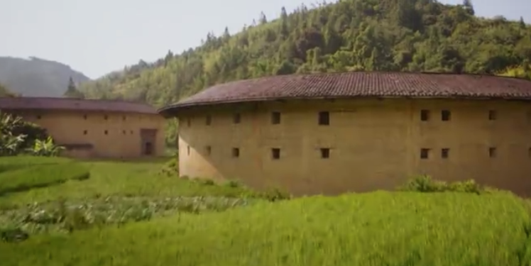
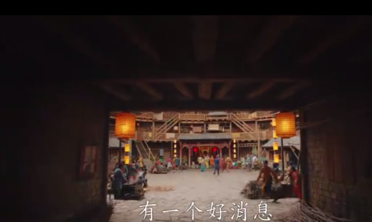
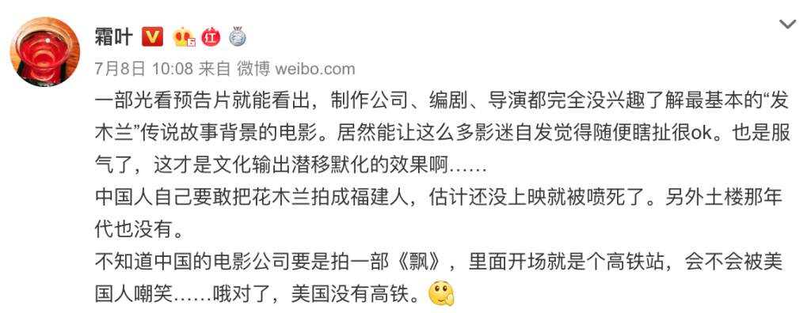

# 迪士尼的花木兰真人版里面出现福建土楼到底是不是一个大槽点

- https://codechina.org/2019/07/hua-mu-lan/

这几天，迪士尼的花木兰真人版的预告片开始在网络上刷屏。演员阵容很强大，刘亦菲的主演就不用说了，连甄子丹，郑佩佩都来给她配戏。画面很好看，刘亦菲的造型英姿飒飒，但是很多人很快就在花木兰的预告片里面发现了点奇怪的东西。

咦，这不是福建土楼么？

从内景看，也是福建土楼无疑

这马上引起了很多人的质疑，比如著名的微博大V @霜叶 就连续发了几条微博说这个事儿：

我也觉得有点离谱，就转发了霜叶的一条微博，说：

> 这个槽点其实也不完全准。木兰辞实际上是个文学作品，到底是不是北魏还是有点争议的，当然大概率是。但是万一是南边发生的故事被北边的人民给加工成文学作品了呢？这个概率其实也不是没有。但是这个福建土楼，最本质的槽点是朝代不对，木兰辞时间在北魏左右，最晚在唐朝。而福建土楼最早在明朝。

然而我在刷twitter的时候，发现了这么一条推：

这个条引起了我的强烈兴趣的原因就是，我国虽然一直被错误的说成几千的封建统治，其实分封在秦以后就越来越少，我们从秦以后其实是大一统的王朝为主流。所以在西方的城堡式建筑国内很少。而坞堡是啥呢？我又查了一些资料，下面来自于wiki：

> 坞壁，又称坞堡，是一种民间防卫性建筑，大约形成王莽天凤年间，当时北方大饥，社会动荡不安。富豪之家为求自保，纷纷构筑坞堡营壁。
>
> 东汉建立后，汉光武帝曾下令摧毁坞堡，但禁之不能绝，由于西北边民常苦于羌患，百姓又自动组织自卫武力。黄巾之乱后，坞堡驻有大批的部曲和家兵，成为故吏、宾客的避风港。史家陈寅恪在《桃花源记旁证》一文中认为：“西晋末年戎狄盗贼并起，当时中原避难之人民……其不能远离本土迁至他乡者，则大抵纠合宗族乡党，屯聚堡坞，据险自守，以避戎狄寇盗之难”
>
> 坞堡可以算是一种地方自卫武力，后来演变成南宋的义军、清代的团练。
>
> [https://zh.wikipedia.org/wiki/%E5%A1%A2%E5%A0%A1](https://zh.wikipedia.org/wiki/%E5%A1%A2%E5%A0%A1)

而坞堡和福建的土楼，围龙屋有什么关系呢？我又找到了一些资料：

> 说到客家人，不得不令人想起风起云涌的战 乱与动荡的社会形势。而正是因为社会的不安定，才催生了“坞壁”或称 “坞堡”这种半民用半军事化的建筑堡垒形式。这种建筑堡垒，在南方，也就是今天我们所见到的“客家围龙屋”或  “客家碉楼”。而在古代的泛中原地区，其实也广泛存在着与南方围龙屋或碉楼基本一致的建筑堡垒形式——“坞”、“坞壁”、“营坞”或“坞侯”。         “坞壁”或“营坞”最早的起源，在我看来恐怕要追溯到先秦夏商周时代，而汉代就在边塞地方作为防御工事建立了很多小城堡。然后，十六国、唐代藩镇割据时期这种建筑堡垒一直都很兴盛。
>
> 风云骤起，烽火连天之际，原泛中原及边关地区的这种坞堡连带其内部的人员，在“大南迁”的时代洪流裹挟之下，来到了南方，同时随之而来的还有原来的内部关系。部曲，又称为“客”、“客户”。部曲，本意是当时的部队编制或私家兵丁，后指仆役。“将军营五部，校卫一人”；“部有曲，曲有军侯一人”。
>
> 由此可见，这种“主客”关系，本指坞堡或坞壁内部之“主客”关系，而非南迁以后南迁族群与其他人群之间的关系。
>
> 作者：武备府 [https://www.jianshu.com/p/4e8538014a16](https://www.jianshu.com/p/4e8538014a16)

所以，福建客家人的围龙屋，土楼其实就是坞堡的传承，甚至，客家人的名字，都跟坞堡这种形式紧密不可分割。

所以，我改变了，我的想法。当然这只是我的猜测。迪士尼也许做了比较认真的考证，知道在北魏时期坞堡流行，这是木兰这个戏的一个背景，所以才特意找了福建土楼作为背景进行拍摄。

当然这只是猜测，也许迪士尼确实是胡编，也许他们只是随便在某张风景图看到了福建土楼，觉得很好看。这也是有可能的。

**为什么我不是给迪士尼洗地呢？**（在中国你经常会被问这个愚蠢的问题）

1. 这根本不是面向中国的预告片，如果你真的了解国际电影市场，你就会知道，其实中国引进的片子没有多少，很多好片子没有引进。迪士尼这部花木兰还不知道进不进呢。不进的话有啥可洗的？
2. 花木兰对迪士尼来说不算多大的IP，迪士尼更大的IP有的是。
3. 目前我还没打通和好莱坞的合作管道，如果你们可以帮我打通谢谢。

我发这篇文章的意义在于，我们对我们的历史其实有很多不了解的地方。这次很多人对迪士尼的质疑，让我更多的了解了一些历史的细节，我觉得对我意义重大。很多人喜欢在网上争论，其实迪士尼对了，还是错了，该看电影的人还是会去看。争论成功与否意义何在？

> 我们年轻的时候，有句名言叫做抬杠长学问。如果你跟别人争论，抬杠。你为了说服别人，你寻找了很多资料，增长了你的见识。那么你吵架赢了输了并不重要，你进步了。
>
> 反之，如果你只在乎输赢，同时也不去寻找资料学习，就是靠嘴，靠谩骂，你就算赢了，对你又有什么意义呢？

至于迪士尼的光辉，呵呵，就算真的拍砸一两部电影，是没办法磨灭的。哈哈。所以，谁在乎迪士尼的地啊，洗不洗都一样啊。
